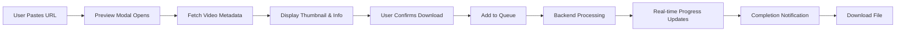

# 🎬 YouTube Video Downloader v1.0

<div align="center">


**A sleek, modern web application for downloading YouTube videos with an exceptional user experience.**

[Features](#-features) • [Tech Stack](#-tech-stack) • [Installation](#-installation) • [Usage](#-usage) • [Screenshots](#-screenshots)

</div>

---

## ✨ Features

### 🎯 Core Functionality
- **Video Preview Modal** - See thumbnail, title, duration, and details BEFORE downloading
- **Batch Download Support** - Paste multiple URLs at once (one per line)
- **Sequential Queue System** - Downloads process one by one, preventing network overload
- **Real-Time Progress Tracking** - Live speed, ETA, and byte-level download stats
- **Smart Status Stages** - Visual feedback at every stage (Preparing → Downloading → Processing → Complete)
- **Completion Notifications** - Beautiful success modal with auto-close and download button

### 🎨 User Experience
- **Responsive Modern UI** - Clean, dark-themed interface built with Tailwind CSS
- **Smooth Animations** - Gradient progress bars with shimmer effects
- **Color-Coded Status** - Instantly recognize download states with visual cues
- **No More Flashing** - Modals stay visible, smooth transitions throughout
- **Format & Quality Selection** - Choose between MP4, MKV, AVI, MP3, AAC, WAV with quality presets

### ⚙️ Advanced Options
- **Subtitle Download** - Automatic subtitle extraction in multiple languages
- **Audio Transcription** - AI-powered transcription support (optional)
- **Time Range Selection** - Download specific sections of videos
- **Network Settings** - Control concurrent connections and chunk sizes
- **Advanced Subtitle Options** - Translation, format selection (SRT, VTT, etc.)

---

## 🛠️ Tech Stack

<div align="center">

### Frontend


### Backend


### Tools & Libraries


</div>

---

## 🎯 How It Works



### Detailed Flow
1. **📝 Submit URL(s)** - Paste single or multiple YouTube URLs
2. **🎬 Preview** - See video details, thumbnail, duration before downloading
3. **✅ Confirm** - Review and confirm the download
4. **⚡ Queue Processing** - Backend receives job and assigns unique `job_id`
5. **📊 Real-Time Updates** - Frontend polls `/api/download/status/<job_id>` every 2 seconds
6. **🎨 Visual Feedback** - Progress bar, speed, ETA, and bytes transferred update live
7. **🎉 Completion** - Success notification with download button and auto-close
8. **🔄 Next!** - Queue automatically processes the next video

---

## 📦 Installation

### Prerequisites
- **Python 3.8+** ([Download](https://www.python.org/downloads/))
- **Node.js 16+** ([Download](https://nodejs.org/))
- **FFmpeg** ⚠️ **REQUIRED** - See [FFmpeg Setup](#ffmpeg-setup) below

### Quick Start

#### 1️⃣ Backend Setup

```bash
# Navigate to backend directory
cd backend

# Create virtual environment
python -m venv venv

# Activate virtual environment
# Windows:
.\venv\Scripts\activate
# macOS/Linux:
source venv/bin/activate

# Install dependencies
pip install -r requirements.txt

# Run Flask server
python run.py
```

Backend will run at **http://127.0.0.1:5000**

#### 2️⃣ Frontend Setup

```bash
# Navigate to frontend directory (new terminal)
cd frontend

# Install dependencies
npm install

# Run development server
npm run dev
```

Frontend will run at **http://localhost:5173**

#### 3️⃣ FFmpeg Setup

**⚠️ IMPORTANT:** FFmpeg is **required** for video/audio processing.

**Option 1: Local Installation (Recommended)**
```bash
# 1. Download FFmpeg for your platform:
#    Windows: https://www.gyan.dev/ffmpeg/builds/ (ffmpeg-release-essentials.zip)
#    macOS: https://evermeet.cx/ffmpeg/
#    Linux: Use package manager (see below)

# 2. Extract binaries to backend/ffmpeg/:
#    - ffmpeg.exe (or ffmpeg on macOS/Linux)
#    - ffprobe.exe (or ffprobe on macOS/Linux)

# 3. Verify:
# Windows:
.\backend\ffmpeg\ffmpeg.exe -version

# macOS/Linux:
./backend/ffmpeg/ffmpeg -version
chmod +x backend/ffmpeg/ffmpeg  # Make executable if needed
```

**Option 2: System-Wide Installation**
```bash
# Windows (Chocolatey)
choco install ffmpeg

# macOS (Homebrew)
brew install ffmpeg

# Linux (Ubuntu/Debian)
sudo apt update && sudo apt install ffmpeg
```

**📝 Note:** FFmpeg binaries are excluded from Git due to their large size (~100-200 MB). Each user must download them separately.

**Full instructions:** See [`backend/ffmpeg/README.md`](backend/ffmpeg/README.md)

#### 🧪 Verify Installation

Run the verification script to check if everything is set up correctly:

```bash
python verify-setup.py
```

This will check:
- Python version (3.8+)
- Node.js and npm
- FFmpeg installation
- Python packages
- Frontend packages
- Directory structure

---

## 🚀 Usage

### Single Video Download
1. Open http://localhost:5173
2. Paste YouTube URL: `https://www.youtube.com/watch?v=...`
3. Select format (MP4, MP3, etc.) and quality
4. Click **"Preview & Download"**
5. Review video details in preview modal
6. Click **"Download Video"**
7. Watch real-time progress
8. Get completion notification and download file!

### Batch Download
1. Click **"Batch Mode"** toggle
2. Paste multiple URLs (one per line):
   ```
   https://www.youtube.com/watch?v=...
   https://www.youtube.com/watch?v=...
   https://www.youtube.com/watch?v=...
   ```
3. Click **"Preview N Videos"**
4. Review all videos in preview modal
5. Click **"Download N Videos"**
6. Videos download sequentially with progress tracking

### Advanced Options
- **Subtitles**: Enable subtitle download with language selection
- **Transcription**: AI-powered audio transcription (requires Whisper)
- **Time Range**: Download specific sections (HH:MM:SS format)
- **Network Settings**: Adjust concurrent connections and chunk size

---

## 📸 Screenshots

### Video Preview Modal
Beautiful preview with thumbnail, video info, and confirmation before downloading.


### Real-Time Progress
Gradient progress bars with speed, ETA, and bytes transferred.


### Completion Notification
Satisfying success modal with animated checkmark and download button.


---

## ⚙️ Configuration

### Backend Configuration
Edit `backend/app/__init__.py` for:
- Upload folder location
- API endpoints
- CORS settings

### Frontend Configuration
Edit `frontend/vite.config.js` for:
- API proxy settings
- Build options
- Dev server port

---

## 🔧 API Endpoints

| Endpoint | Method | Description |
|----------|--------|-------------|
| `/api/metadata` | POST | Fetch video metadata without downloading |
| `/api/download` | POST | Start a new download job |
| `/api/download/status/<job_id>` | GET | Get real-time download status |
| `/api/download/file/<filename>` | GET | Download completed file |
| `/api/download/thumbnail/<filename>` | GET | Get video thumbnail |

---

## 📝 Project Structure

```
youtube-downloader/
├── backend/
│   ├── app/
│   │   ├── api/
│   │   │   ├── routes.py         # API endpoints
│   │   │   └── download_manager.py  # Job management
│   │   ├── utils/
│   │   │   ├── downloader.py     # yt-dlp integration
│   │   │   └── transcription.py  # Audio transcription
│   │   └── __init__.py
│   ├── ffmpeg/                   # FFmpeg binaries
│   ├── requirements.txt
│   └── run.py
│
├── frontend/
│   ├── src/
│   │   ├── components/
│   │   │   └── ui/
│   │   │       ├── download/
│   │   │       │   ├── DownloadForm.vue
│   │   │       │   ├── VideoPreviewModal.vue
│   │   │       │   ├── CompletionNotification.vue
│   │   │       │   ├── DownloadItem.vue
│   │   │       │   ├── QueueList.vue
│   │   │       │   └── DownloadList.vue
│   │   │       └── common/
│   │   ├── stores/
│   │   │   └── download.js       # Pinia store
│   │   ├── views/
│   │   │   ├── HomeView.vue
│   │   │   └── DownloadView.vue
│   │   └── App.vue
│   ├── package.json
│   └── vite.config.js
│
├── DOWNLOAD_UX_IMPROVEMENTS.md   # UX redesign documentation
└── README.md
```

---

## 🌟 What's New in v1.0

### Major Features
✅ **Video Preview System** - See before you download
✅ **Batch Download Support** - Multiple URLs at once
✅ **Completion Notifications** - Beautiful success modals
✅ **Enhanced Progress Tracking** - Real-time stats and stages
✅ **Smooth Animations** - Professional UI/UX throughout

### Technical Improvements
✅ Metadata fetching API endpoint
✅ Download status stages (Preparing → Starting → Downloading → Processing → Complete)
✅ Completion notification queue system
✅ Better error handling and user feedback

See [DOWNLOAD_UX_IMPROVEMENTS.md](DOWNLOAD_UX_IMPROVEMENTS.md) for detailed changelog.

---

## ⚠️ Limitations

- **No Backend Cancellation**: Cancel button removes from queue but doesn't terminate backend process
- **No Pause Support**: Pause button is currently UI-only
- **Memory-Only Storage**: Queue and history are not persisted to database
- **Development Server**: Not production-ready (use WSGI server for production)

---

---

## 🤝 Contributing

Contributions are welcome! Please feel free to submit a Pull Request.

1. Fork the repository
2. Create your feature branch (`git checkout -b feature/AmazingFeature`)
3. Commit your changes (`git commit -m 'Add some AmazingFeature'`)
4. Push to the branch (`git push origin feature/AmazingFeature`)
5. Open a Pull Request

---

## 📄 License

This project is licensed under the MIT License - see the [LICENSE](LICENSE) file for details.

---

## 🙏 Acknowledgments

- **yt-dlp** - Powerful YouTube download library
- **FFmpeg** - Video/audio processing
- **Vue.js** - Progressive JavaScript framework
- **Tailwind CSS** - Utility-first CSS framework
- **Lucide Icons** - Beautiful icon set

---

## ⚡ Performance

- **Fast Metadata Fetching**: ~1-2 seconds average
- **Concurrent Downloads**: Sequential queue prevents overload
- **Memory Efficient**: Background threads with proper cleanup
- **Real-Time Updates**: 2-second polling interval for smooth UX

---

## 🔒 Privacy & Security

- ✅ **No Data Collection** - All processing happens locally
- ✅ **No External Services** - Direct YouTube download only
- ✅ **No User Tracking** - No analytics or telemetry
- ✅ **Open Source** - Fully transparent codebase

---

## ⚠️ Disclaimer

**Educational Use Only**

This project was created for educational purposes and personal use (archiving personal YouTube content). Users are responsible for complying with YouTube's Terms of Service and applicable copyright laws. Only download content you have the rights to or that is explicitly available for download.

For concerns or takedown requests, please contact me via [LinkedIn](https://linkedin.com/in/yourusername).

---

## 👨‍💻 About This Project

Built in early 2024 as a learning project using Vue.js and Flask - my first experience with web frameworks. Since then, I've expanded my skillset to include:

- **TypeScript + React** (frontend)
- **FastAPI** (Python backend)
- **TypeScript + Node.js** (backend)

A v2.0 rewrite using **FastAPI + TypeScript Vue** is under consideration to demonstrate growth and explore modern development patterns.

Contributions and feedback are welcome via pull requests or issues.

---

<div align="center">

[Report Bug](https://github.com/andynaisbitt/Python-Vue-Media-Downloader/issues) • [Request Feature](https://github.com/andynaisbitt/Python-Vue-Media-Downloader/issues)

</div>
